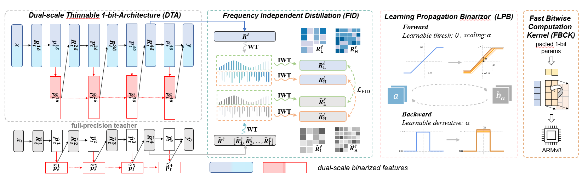

# *BiFSMNv2: Pushing Binary Neural Networks for Keyword Spotting to Real-Network Performance*

Created by [Haotong Qin](https://htqin.github.io/), Xudong Ma, [Yifu Ding](https://yifu-ding.github.io/), Xiaoyang Li, Yang Zhang, Zejun Ma, Jiakai Wang, Jie Luo, and [Xianglong Liu](https://xlliu-beihang.github.io/) from Beihang University, Bytedance AI Lab, and Zhongguancun Laboratory.



## Introduction

This project is the official implementation of our accepted TNNLS 2023 paper [*BiFSMNv2: Pushing Binary Neural Networks for Keyword Spotting to Real-Network Performance*](https://arxiv.org/abs/2211.06987). Abstract—Deep neural networks, such as the Deep-FSMN, have been widely studied for keyword spotting (KWS) applications while suffering expensive computation and storage. Therefore, network compression technologies like binarization are studied to deploy KWS models on edge. In this paper, we present a strong yet efficient binary neural network for KWS, namely **BiFSMNv2**, pushing it to the real-network accuracy performance. First, we present a *Dual-scale Thinnable 1-bit Architecture* to recover the representation capability of the binarized computation units by dual-scale activation binarization and liberate the speedup potential from an overall architecture perspective. Second, we also construct a *Frequency Independent Distillation* scheme for KWS binarization-aware training, which distills the high and low-frequency components independently to mitigate the information mismatch between full-precision and binarized representations. Moreover, we propose the *Learning Propagation Binarizer*, a general and efficient binarizer that enables the forward and backward propagation of binary KWS networks to be continuously improved through learning. We implement and deploy the BiFSMNv2 on ARMv8 real-world hardware with a novel *Fast Bitwise Computation Kernel*, which is proposed to fully utilize registers and increase instruction throughput. Comprehensive experiments show our BiFSMNv2 outperforms existing binary networks for KWS by convincing margins across different datasets and achieves comparable accuracy with the full-precision networks (only a tiny $1.51\%$ drop on Speech Commands V1-12). We highlight that benefiting from the compact architecture and optimized hardware kernel, BiFSMNv2 can achieve an impressive $25.1\times$ speedup and $20.2\times$ storagesaving on edge hardware.

## Datasets and Pretrained Models

We train and test BiFSMNv2 on Google Speech Commands V1 and V2 datasets, which can be downloaded in the reference document:

- https://pytorch.org/audio/stable/_modules/torchaudio/datasets/speechcommands.html#SPEECHCOMMANDS

And we also release a pretrained model on Speech Commands V1-12 task for our distillation.

## Execution

Our experiments are based on the fine-tuned full-precision BiFSMN_pre, which can be found here. Complete running scripts is provided as follow

```shell
python3 train_speech_commands.py \
    --gpu=0 \
    --model=BiDfsmn_thinnable --dfsmn_with_bn \
    --method=lpb \
    --distill \
    --distill_alpha=0.01 \
    --select_pass=fid \
    --J=1 \
    --pretrained \
    --teacher_model=BiDfsmn_thinnable_pre \
    --teacher_model_checkpoint=${teacher_model_checkpoint_path} \
    --version=speech_commands_v0.01 \
    --num_classes=12 \
    --lr-scheduler=cosin \
    --opt=sgd \
    --lr=5e-3 \
    --weight-decay=1e-4 \
    --epoch=300 \
```

## Citation

If you find our work useful in your research, please consider citing:

```shell
@inproceedings{qin2023bifsmnv2,
  title     = {BiFSMNv2: Pushing Binary Neural Networks for Keyword Spotting to Real-Network Performance},
  author    = {Haotong Qin, Xudong Ma, Yifu Ding, Xiaoyang Li, Yang Zhang, Zejun Ma, Jiakai Wang, Jie Luo, Xianglong Liu},
  booktitle = {IEEE Transactions on Neural Networks and Learning Systems (TNNLS)},
  year      = {2023}
}
```
